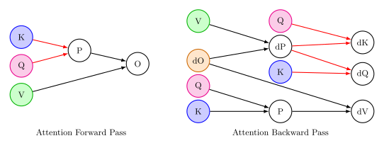
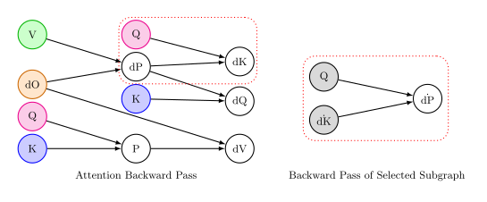
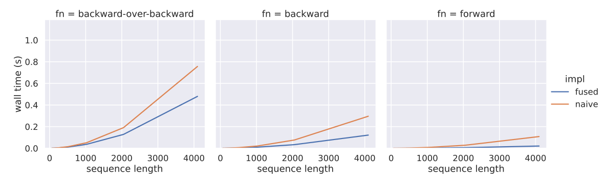
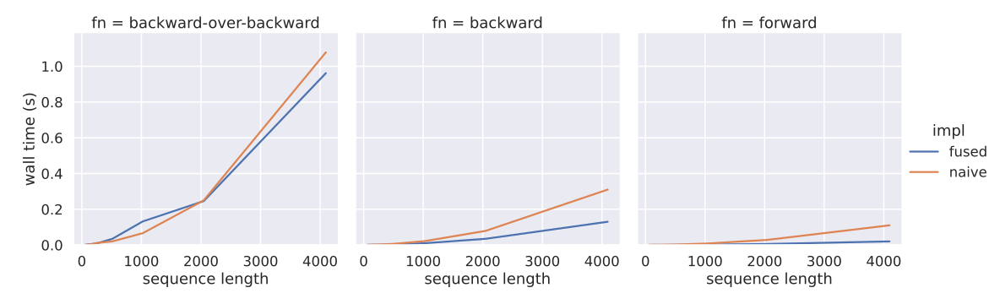

##  Flashback: A FlashAttention-style backwards-over-backwards ⚡🔙🔙
<p align = 'center'>
[<a href="#whatwhy">why</a>]
[<a href="#quickstart">quickstart</a>]
[<a href="#usage">usage</a>]
[<a href="#sharp-pointsbest-practicesprecision-gotchas">pointy bits</a>]
[<a href="#the-softmax-attention-calamity">the softmax attention calamity</a>]
[<a href="#experiments">experiments</a>]
  [<a href="#autotuner">autotuner</a>]
  <br>
  by <a href="https://loganengstrom.com">Logan Engstrom</a> and <a href="https://feldmann.nyc">Axel Feldmann</a>
</p>

This Jax/[Pallas](https://docs.jax.dev/en/latest/pallas/index.html)/Triton project extends [fused attention](https://arxiv.org/abs/2205.14135) to support the backwards pass over the backwards pass (for e.g., <a href="https://arxiv.org/abs/2503.13751">differentiating over model training</a>). The main contributions are two-fold:

- Fused backwards-over-backwards kernels for softmax (and sigmoid) attention operators
- A rudimentary Pallas [autotuner](https://triton-lang.org/main/python-api/generated/triton.autotune.html)

Sigmoid attention double backwards is very fast; softmax attention double backwards is not (yet) very fast. This is due to both (a) the structure of the computation and (b) the nature of the fused attention trick. In what follows, we include [derivations](https://github.com/lengstrom/flashback/blob/main/derivations.py) of the backwards-over-backward pass, and primers on why this (open) problem is hard - see the [The Softmax Attention Calamity](#the-softmax-attention-calamity) section below for details.

## What/Why?
<p><b><i>What</i> is the "backwards-over-backwards"</b> (over attention)? Recall that autograd is a two step procedure: (1) perform the operations comprising the function of interest, then (2) calculate the gradient by repeatedly the "backward pass" of each operation executed in the forward pass (via the chain rule). Any operation we want to differentiate over needs a backwards pass; as an example, consider the compute graph for attention alongside the compute graph for its backwards pass. The operations for "compute the probability matrix from $\text{Q}$ and $\text{K}$" correspond to the operations in the backwards pass for "compute the gradients $\text{dK}$ and $\text{dQ}$ from $\text{dP}$:"

Therefore, if we want to perform autograd over a backwards pass, then we need a backwards pass for the *backwards pass itself*: this is exactly the "backwards-over-backwards."
</p>

<b><i>Why</i> implement a fused attention backwards-over-backwards?</b> First, its a cool problem! But maybe more importantly, it enables calculating the gradient of any function that has a backwards pass over attention in it, such as model training steps. The gradient over model training steps arises in [metalearning](https://arxiv.org/abs/1703.03400), [optimizing over model training](https://arxiv.org/abs/2503.13751)/[hyperparameter search](https://arxiv.org/abs/1502.03492), [architecture search](https://arxiv.org/abs/1806.09055), [data poisoning](https://arxiv.org/abs/2204.09092) and more. By implementing a high throughput/memory efficient fused backwards-over-backwards for we hope to accelerate research in these areas for attention-based models (like transformers/LMs/VLMs).

## Quickstart

Install with pip (`pip install git+https://github.com/lengstrom/flashback.git`). Example usage:

```python
# For a runnable example see `example.py` in the root.
from flashback.ops import softmax_mha

# Q: (B, R, H, D), K & V: (B, C, H, D)
Q, K, V = ...

# forward
fwd = jax.jit(softmax_mha)
o = fwd(Q, K, V)

# backward
bck = jax.jit(jax.grad(lambda Q, K, V: fwd(Q, K, V).sum(), argnums=[0, 1, 2]))
dQ, dK, dV = bck(Q, K, V)

# backwards-over-backwards
reduced_back = lambda Q, K, V: sum(d.sum() for d in bck(Q, K, V))
bckbck = jax.jit(jax.grad(reduced_back, argnums=[0, 1, 2]))
ddQ, ddK, ddV = bckbck(Q, K, V)
```
**NOTE**: The first time you run this there will be a bunch of messages about autotuning. That is normal, see the [Autotuner](#Autotuner) section for more details if you are interested or run into any problems. 

## Overview
Fused attention methods group operations together into a *single* GPU kernel when calculating products with the attention matrix. This helpful because (a) it avoids unnecessary data movement to/from GPU main memory and (b) it reduces the backward pass's memory footprint. As a result FlashAttention (the best known fused attention) is both faster and (much) more memory efficient. 

Standard implementations do not support the backwards over backwards (2nd derivatative) pass, and AD cannot autogenerate the this pass due to the difficulty of tracing fused kernels. This project provides kernels for this operation for both sigmoid and standard attention.

## Usage
We document by example. See the docstrings in [flashback/ops.py](https://github.com/lengstrom/flashback/blob/f32_fa/flashback/ops.py) for more details.

```python
# Available fused operators + precision Enum
from flashback import sigmoid_mha, softmax_mha
from flashback import Precision

Q, K, V = ... # attention input matrixes - Q: (B, R, H, D), K & V: (B, C, H, D)
bias, sm_scale = ... # floats; these mean what you think they mean but see docstring for full details
causal = True # true or false
precision = Precision.TF32_ROUND # or FP16 or FP32 or BF16... # controls the precision of the operation

# calculate output
O = sigmoid_mha(Q, K, V, sm_scale, bias, causal)
```

## Sharp Points/Best Practices/Precision gotchas
It is easy to cut yourself with this project. Some things to watch out for:

- **Precision**: If you use BF16 and find yourself with bad double backwards gradients, try using TF32 precision (`Precision.TF32_ROUND`) or maybe FP16 precision (note that `Precision.FP16` is not tested as Jax does not support FP16 very well). These precision problems arise from the fact that double backwards has quite high computational depth.
- **Sigmoid attention**: This is really fast and works really well, you should use this if you can!
- **Softmax double backwards in general**: I have not really been able to find a use for the softmax double backwards, in most practical cases it is roughly as fast as naive attention (even ~including memory gains..). See [open problems](#the-softmax-attention-calamity) section below.
- **Large attention `d` compared to `T`**: If your per-head dimension is large relative to the sequence length fused attention methods will be slow (relative to naive computation) as they need to recompute the attention matrix many times (particularly in the backwards over backwards).
- **The autotuner failing**: The autotuner has a tqdm bar that runs, if it stops for an extended period of time look at the autotuner section below for possible remedies; please file an issue if you run into this.

## The Softmax Attention Calamity
*Note: For more context, read about the backwards pass of [flash attention](https://arxiv.org/abs/2205.14135).*

Our <i>softmax</i> attention double backwards can have calamitous performance. Indeed, often does not greatly improve throughput in practical settings and can even match (or lose to) the naive implementation. This is due to both (a) <ins>the nature of the fused attention trick</ins> and (b) 
<ins>the structure of the softmax attention computation</ins>.

<p><b>Pushing the limits of the fused attention trick.</b> With regard to (b), the fused attention trick <i>necessarily</i> requires reinstantiating the probability matrix on every pass. Thinking about the entire chain of compute when calculating the gradient with autograd: a pipeline that only completes the backward pass requires only two reinstantiations (once in the forward pass, once in backward). In contrast, any pipeline that includes the double backward pass requires at least 2 additional reinstantiations <i>on top of</i> those in the backwards pass (to see this, think about how we backprop on this compute graph: our forward pass here is "forward to backward", so we have to do one backwards over the backwards, then another backwards over the forward before finishing). In contrast,
backprop over naive attention simply saves all the intermediate products so there is no additional recomputation cost. This is a pretty classic algorithmic tradeoff: storing vs. recomputing.

The complexity of the double backwards kernels also have additional (negative) performance implications. Because of the sheer number of operands and matrix multiplications involved, we're pushing the Pallas/Triton compiler to its limits. Operating on so many tensors in a single kernel quickly exhausts available SRAM,
and many of the compiler tricks used to automatically optimize smaller kernels (e.g., fused attention forward pass) don't work in our setting.
</p>

<p><b>The structure of the softmax backwards-over-backwards.</b> With regard to (a), our has to reinstantiate the probability matrix <i>twice</i> in the
double backwards pass to backpropagate over the backwards pass properly. The problem is that in the compute DAG, there are "rowwise" quantities that we cannot compute ahead of time, so we need to do reinstantiate most of the intermediate attention products to compute <a href="https://github.com/lengstrom/flashback/blob/main/flashback/attentions/flash_softmax_bob_kernel.py#L126">them</a> before the <a href="https://github.com/lengstrom/flashback/blob/main/flashback/attentions/flash_softmax_bob_kernel.py#L199">final output</a>. To see where these quantities appear, we refer to the compute graph of the backwards pass (and, on the right, a subgraph of the backwards pass for the backwards pass):


Computing the softmax-induced probability matrix $\text{P}$ (or differentiating across this operation) requires calculating rowwise values. <a href"https://github.com/lengstrom/flashback/blob/main/derivations.py#L64">Explicitly writing out</a> the backwards-over-backwards pass, we can see that this includes the contribution to $\dot{\text{dP}}$ propagated from $\dot{\text{dK}}$ (featured) among others.
  
In contrast, both the forward and backward passes of fused attention we can get away with only reinstantiating this probability matrix only <i>once</i> (in the backwards pass case, by cleverly memoizing state e.g., maxes and sums in the forward pass). We tried to avoid doing two additional recomputations (by saving additional state/reordering the compute graph), but could not find a way out. Please prove us wrong! As a starting point, you might find this helpful: we write out the entire backwards-over-backwards pass in "math" [here](https://github.com/lengstrom/flashback/blob/main/derivations.py) using Jax, and include tests if you want to refactor the compute graph.

<p><b>Sigmoid attention.</b> One light in the darkness here is sigmoid attention; sigmoid attention uses an elementwise activation (rather than "rowwise" over the input sequence as softmax attention is) so the double gradients are much faster/more straightforward. We can get away with only 4 reinstantiations total (rather than 5 in the double backwards case) and the operations are much simpler. This really shows up in the section below where we profile the different attentions.
</p>

## Experiments
Below, we measure walltime while varying sequence length (we fix batch size / dimension / number of heads; see the [experiment code](https://github.com/lengstrom/flashback/blob/main/tests/walltime.py#L92) for details. We measure for both sigmoid attention and softmax attention. In this setup our results are strong. Sigmoid attention dominates naive sigmoid attention in walltime, and softmax attention is at least as performant as its naive counterpart. At the same time, both methods (should) also use much less memory (we do not plot memory usage as it is tricky in Jax, but we expect fused attention to use ~linear memory in sequence length, while naive attention uses ~quadratic memory in sequence length). Together these results should make your model higher throughput. YMMV depending on your setting. In detail, the functions we test are:

- **Forward**: just the forward pass
- **Backward**: the forward pass then backward pass
- **Backward-over-backward**: the forward pass then the backward pass, then the "backward" over this composition (i.e., in full, forward -> backward -> backward over backward -> backward)

### Sigmoid Attention


### Softmax Attention


## Autotuner
In Pytorch land, Triton has an autotuner that lets you input a menu of possible
hyperparameters for your kernel execution and automatically grid search
over them to identify the best possible configuration. In Jax land, Pallas has
[no such tool](https://github.com/jax-ml/jax/issues/24340#issuecomment-2420227141).

This project includes a rudimentary autotuner in [`flashback/autotune.py`](https://github.com/lengstrom/flashback/blob/main/flashback/autotune.py). It spawns a process on the first execution of a kernel in the compute graph to search for the best config (out of the specified grid of possible configs). It caches
these configs in the `/tmp` folder. Our autotuner
used to break all the time, but breaks less now. If you have problems please report an issue and we will try to fix it.

### Controlling the autotuner
There are two environmental variables you can control the autotuner with:

- `DEBUG_AUTOTUNER=true` deletes the cache the script upon module loading
- `SKIP_AUTOTUNER=true` skips the autotuner (by choosing the first possible config)


